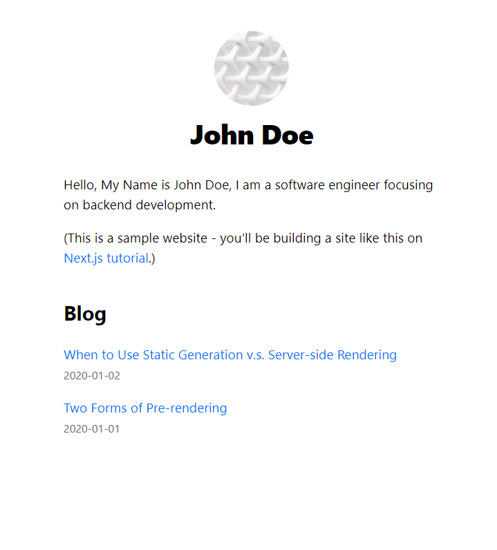

# Next.js Blog

A tutorial from Next.js -> [Learn Next.js](https://nextjs.org/learn).

## How-to Run

```bash
npm run dev
# or
yarn dev
# or
pnpm dev
# or
bun run dev
```

## Screenshots

**Home Page**


**Article Page**

