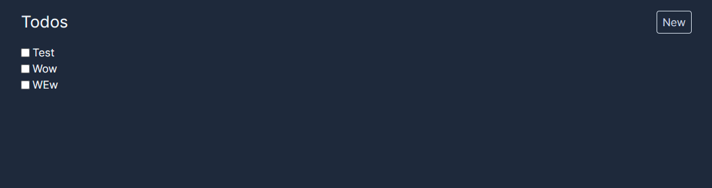
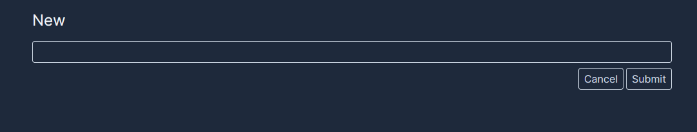

# Todo List

Simple todo list app from YouTube tutorial.

YouTube Video: [Link](https://www.youtube.com/watch?v=NgayZAuTgwM)

## How-to Run

```bash
npm run dev
# or
yarn dev
# or
pnpm dev
# or
bun run dev
```

## Screenshots

**Home Page**

**New Page**


## Commands
```shell
# Setup db to use sqlite
$ npx prisma init --datasource-provider sqlite
# Migrate
$ npx prisma migrate dev --name init
```